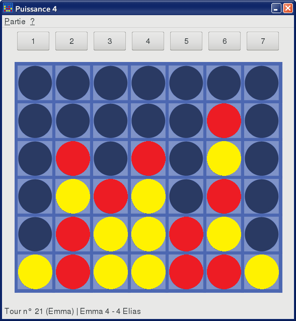
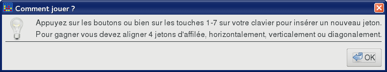
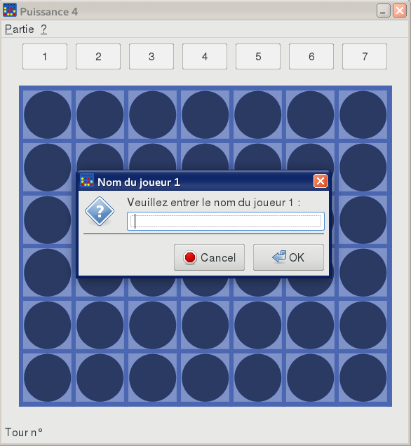
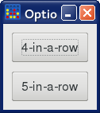
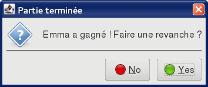

Puissance 4
===========

Instructions
------------

### Installation

1. Télécharger l'archive [connect4.jar](https://git.unistra.fr/s3/a31-projet/uploads/fc1b7ebf6fb5cb142c9bc4adc410586f/connect4.jar).
2. Dans une fenêtre de terminal, entrer la commande `java -jar connect4.jar`
   dans le répertoire où l'archive JAR est située.

(La version 8 du JRE ou supérieure est recommandée.)

### Mode d'emploi

Les règles du jeu sont rappelées dans la fenêtre `Tutoriel` (menu `?`).

Pour démarrer une nouvelle partie, `Partie > Nouvelle partie` puis suivre les
instructions.

Pour modifier la variante de Puissance 4, aller dans `Partie > Options`.

La barre de statut en bas de la fenêtre principale indique le numéro du tour en
cours, à quel joueur est le tour et le nombre de manches remportées par chaque
joueur.

Quand une partie est terminée, une fenêtre s'affiche offrant la possibilité de
jouer la revanche ; si oui, une nouvelle partie commence avec les mêmes
règles, joueurs et nombre de manches nécessaires pour gagner.

